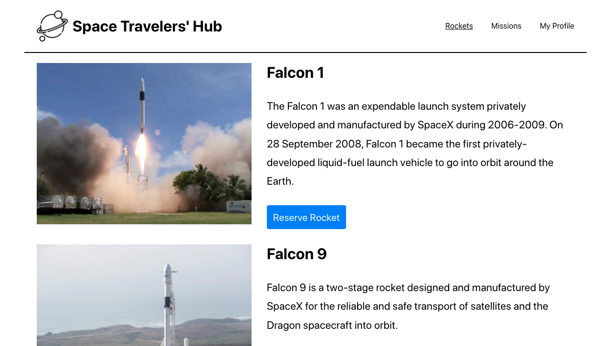

# Space Travelers' Hub



Single-page application that displays SpaceX rockets and missions, allows you to book a rocket or join a mission and see all your booked rockets and your joined mission in your profile page

## Live Demo

[Live Demo](https://space-travelers-hub-pa.netlify.app/)

## Built With

- HTML5 / SASS / JavaScript
- React
- React-Redux
- Redux-Thunk for handling asynchronous dispatch
- SpaceX API

## Getting Started

Clone the repo and enter the directory.

```shell
git clone https://github.com/Amrhub/space-travelers-hub && cd space-travelers-hub
```

### Prerequisites

You need to have `npm` installed on your local machine.

### Install

Install the npm packages.

```shell
npm install
```

### Usage

Run `npm start` to start the local server and try the app.

```shell
npm start
```

### Script

Run all this with npm.

- `npm start`: Starts the local server and opens the web app.

- `npm build`: Builds the web app.

- `npm test`: Runs the tests.

## Authors

👤 **Amr Ahmed**

- GitHub: [@Amrhub](https://github.com/Amrhub/)
- LinkedIn: [Amr Ahmed](https://www.linkedin.com/in/amr-ahmed-655420191/)

👤 **Piero Lescano**

- GitHub: [@piero-vic](https://github.com/piero-vic)
- Twitter: [@v1ccenzo](https://twitter.com/v1ccenzo)
- LinkedIn: [piero-lescano](https://linkedin.com/in/piero-lescano)

## 🤝 Contributing

Contributions, issues, and feature requests are welcome!

Feel free to check the [issues page](../../issues/).

## Show your support

Give a ⭐️ if you like this project!

## 📝 License

This project is [MIT](./MIT.md) licensed.
